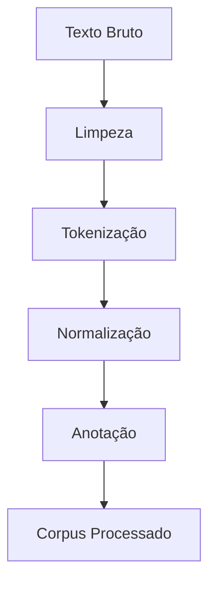

# Sistema de Análise e Processamento

## Estrutura de Diretórios

```
3_analise/
├── corpus_textual/
│   ├── processado/      # Textos após processamento
│   └── bruto/          # Textos originais
├── resultados/
│   ├── metricas/       # Métricas e estatísticas
│   └── relatorios/     # Relatórios de análise
└── ferramentas/
    ├── scripts/        # Scripts de processamento
    └── configuracoes/  # Configurações das ferramentas
```

## Pipeline de Análise

### 1. Preparação do Corpus


### 2. Análise Textual
- Análise morfológica
- Análise sintática
- Análise semântica
- Análise de discurso
- Análise de sentimento

### 3. Métricas
- Frequência de palavras
- Coesão textual
- Complexidade sintática
- Legibilidade
- Similaridade entre textos

## Ferramentas de Processamento

### Scripts Disponíveis
1. `preprocessamento.py`
   - Limpeza de texto
   - Tokenização
   - Normalização

2. `analise_linguistica.py`
   - Análise morfológica
   - Análise sintática
   - Extração de entidades

3. `metricas.py`
   - Cálculo de métricas
   - Geração de estatísticas
   - Visualização de dados

### Configurações
```yaml
preprocessamento:
  lowercase: true
  remove_punctuation: true
  remove_stopwords: true
  
analise:
  modelo_linguistico: "pt_core_news_lg"
  tipo_analise: ["morfologica", "sintatica"]
  
metricas:
  calcular_frequencia: true
  calcular_legibilidade: true
  gerar_graficos: true
```

## Relatórios

### Tipos de Relatório
1. **Análise Básica**
   - Estatísticas gerais
   - Frequência de palavras
   - Métricas de legibilidade

2. **Análise Linguística**
   - Estruturas sintáticas
   - Padrões morfológicos
   - Relações semânticas

3. **Análise Comparativa**
   - Similaridade entre textos
   - Evolução temporal
   - Padrões de mudança

### Formato de Relatório
```markdown
# Relatório de Análise

## Metadados
- Data: YYYY-MM-DD
- Corpus: [nome]
- Tipo de Análise: [tipo]

## Resultados
1. Estatísticas Gerais
   - Total de palavras:
   - Vocabulário único:
   - Densidade lexical:

2. Métricas
   - Legibilidade:
   - Coesão:
   - Complexidade:

3. Visualizações
   [gráficos e tabelas]

## Conclusões
[interpretação dos resultados]
```

## Fluxo de Trabalho

1. **Preparação**
   - Coleta de textos
   - Organização do corpus
   - Configuração de ferramentas

2. **Processamento**
   - Execução de scripts
   - Monitoramento de progresso
   - Validação de resultados

3. **Análise**
   - Cálculo de métricas
   - Geração de visualizações
   - Interpretação de dados

4. **Documentação**
   - Geração de relatórios
   - Arquivamento de resultados
   - Atualização de documentação 