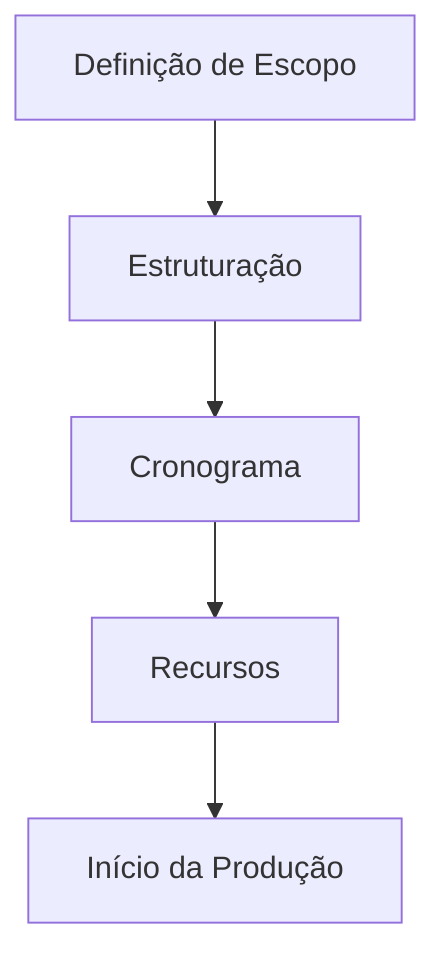

# Sistema de Produção de Conteúdo

## Estrutura de Diretórios

```
4_producao/
├── volumes/
│   ├── em_producao/     # Conteúdo em desenvolvimento
│   ├── revisao/         # Conteúdo em revisão
│   └── publicados/      # Conteúdo finalizado
├── templates/
│   ├── capitulos/       # Templates de capítulos
│   └── secoes/          # Templates de seções
└── controle_qualidade/
    ├── checklists/      # Listas de verificação
    └── metricas/        # Métricas de qualidade
```

## Pipeline de Produção

### 1. Planejamento


### 2. Desenvolvimento
- Criação de conteúdo
- Revisão técnica
- Validação ABNT
- Controle de qualidade

### 3. Revisão
- Revisão por pares
- Correções e ajustes
- Validação final
- Aprovação

## Templates e Padrões

### Estrutura de Capítulo
```markdown
# [Número] - [Título do Capítulo]

## Metadados
- Autor: [nome]
- Versão: [X.Y.Z]
- Status: [rascunho|revisão|aprovado]

## Conteúdo
1. Introdução
2. Desenvolvimento
   2.1. Subtópico
   2.2. Subtópico
3. Conclusão

## Referências
[Lista de referências ABNT]
```

### Padrões de Formatação
```yaml
texto:
  fonte: "Times New Roman"
  tamanho: 12pt
  espacamento: 1.5
  
titulos:
  nivel1: 14pt, negrito
  nivel2: 12pt, negrito
  nivel3: 12pt, itálico
  
margens:
  superior: 3cm
  inferior: 2cm
  esquerda: 3cm
  direita: 2cm
```

## Controle de Qualidade

### Checklists
1. **Pré-produção**
   - [ ] Escopo definido
   - [ ] Recursos identificados
   - [ ] Templates preparados

2. **Produção**
   - [ ] Formatação ABNT
   - [ ] Citações corretas
   - [ ] Referências completas

3. **Revisão**
   - [ ] Revisão técnica
   - [ ] Revisão linguística
   - [ ] Validação ABNT

### Métricas de Qualidade
- Conformidade ABNT
- Coerência textual
- Precisão técnica
- Legibilidade

## Fluxo de Trabalho

1. **Iniciação**
   - Definição de escopo
   - Planejamento
   - Preparação de recursos

2. **Desenvolvimento**
   - Criação de conteúdo
   - Revisões incrementais
   - Validações parciais

3. **Revisão**
   - Revisão completa
   - Ajustes finais
   - Validação ABNT

4. **Finalização**
   - Aprovação final
   - Arquivamento
   - Documentação

## Automação

### Scripts Disponíveis
1. `validacao_abnt.py`
   - Verifica formatação
   - Valida referências
   - Checa citações

2. `geracao_relatorios.py`
   - Métricas de qualidade
   - Status de produção
   - Logs de revisão

3. `backup_conteudo.py`
   - Backup automático
   - Versionamento
   - Logs de alterações

### Integrações
- Sistema de controle de versão
- Ferramentas de revisão
- Gestores bibliográficos
- Validadores ABNT 