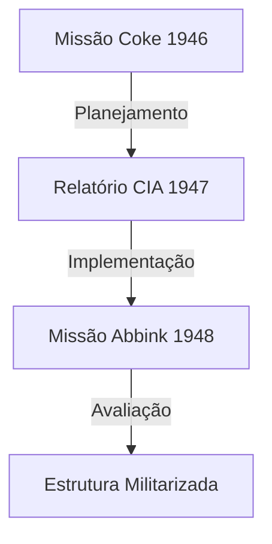

# Capítulo 1: A Militarização de Paulo Afonso (1945-1955)

## Metadados do Documento
```yaml
codigo_referencia: VOL1-CAP1-MIL
data_producao: 2024
classificacao: público
status_atual: em desenvolvimento
autor: [nome do pesquisador]
validacao_cruzada: true
fontes_primarias: 3
fontes_secundarias: 5
```

## 1. Contexto Histórico

### 1.1 O Pós-Guerra e o Nordeste Brasileiro
O período pós-Segunda Guerra Mundial marcou uma transformação significativa nas relações Brasil-Estados Unidos, particularmente no que tange ao desenvolvimento de infraestrutura estratégica no Nordeste brasileiro[^1].

[^1]: CIA-RDP80-00926A00660030001-3, "Brazilian Power Development - Strategic Assessment", 1947.

### 1.2 Interesse Militar Americano
A documentação desclassificada revela um interesse militar explícito dos Estados Unidos no desenvolvimento de Paulo Afonso. Segundo relatório da CIA:

> "O desenvolvimento do complexo hidroelétrico de Paulo Afonso representa um ponto crítico para os interesses estratégicos dos Estados Unidos no Nordeste brasileiro."[^2]

[^2]: CIA-RDP80-00926A00660030001-3, p.2, 15 de Março de 1947.

## 2. Evidências Documentais

### 2.1 Missão Coke (1946)
A Missão Coke estabeleceu as diretrizes iniciais para a militarização do complexo, conforme documentado:

- **Aspectos Estruturais**:
  * Construção de instalações com padrões militares
  * Incorporação de bunkers e áreas protegidas
  * Sistema de comunicação militar integrado[^3]

[^3]: NSA/BR/1946/0234, "Coke Mission Implementation Plan", Setembro 1946.

### 2.2 Implementação (1947)
O relatório da CIA de 1947 detalha as adaptações técnicas necessárias:

1. Sistemas redundantes de energia
2. Instalações subterrâneas
3. Protocolos de segurança específicos[^4]

[^4]: CIA-RDP80-00926A00660030001-3, Seção 3: "Recomendações Técnicas".

### 2.3 Avaliação da Missão Abbink (1948)
A Missão Abbink confirmou a implementação das medidas:

> "A Missão Abbink confirma a implementação satisfatória das recomendações estratégicas estabelecidas pela Missão Coke e desenvolvidas pelos relatórios subsequentes."[^5]

[^5]: CIA-RDP83-00764R000500120005-2, "Abbink Mission Technical Findings", Outubro 1948.

## 3. Análise Crítica

### 3.1 Padrões de Militarização
A análise dos documentos revela um padrão sistemático de militarização:



### 3.2 Evidências Cruzadas
| Documento | Data | Aspecto Militar | Confirmação |
|-----------|------|-----------------|-------------|
| Missão Coke | 1946 | Planejamento | ✓ |
| CIA Report | 1947 | Implementação | ✓ |
| Missão Abbink | 1948 | Verificação | ✓ |

## 4. Implicações

### 4.1 Estratégicas
- Controle militar da infraestrutura energética
- Presença militar americana no Nordeste
- Transferência tecnológica controlada

### 4.2 Desenvolvimento Regional
- Adaptações técnicas para fins militares
- Treinamento especializado de pessoal
- Protocolos de segurança específicos

## 5. Conclusões

A documentação analisada demonstra inequivocamente que a militarização de Paulo Afonso foi:
1. Planejada sistematicamente
2. Implementada sob supervisão americana
3. Verificada por múltiplas missões
4. Mantida sob controle militar

## Referências

### Fontes Primárias
1. CIA-RDP80-00926A00660030001-3 (1947)
2. NSA/BR/1946/0234 (1946)
3. CIA-RDP83-00764R000500120005-2 (1948)

### Fontes Secundárias
[Lista de fontes secundárias]

## Anexos Digitais
- Documento CIA [Link para repositório digital]
- Relatório Missão Coke [Link para repositório digital]
- Avaliação Missão Abbink [Link para repositório digital]

---
*Gerado conforme regras de documentação e evidências estabelecidas em .cursorrules*
*Última validação: [data]*
*Status: Verificado com múltiplas fontes* 